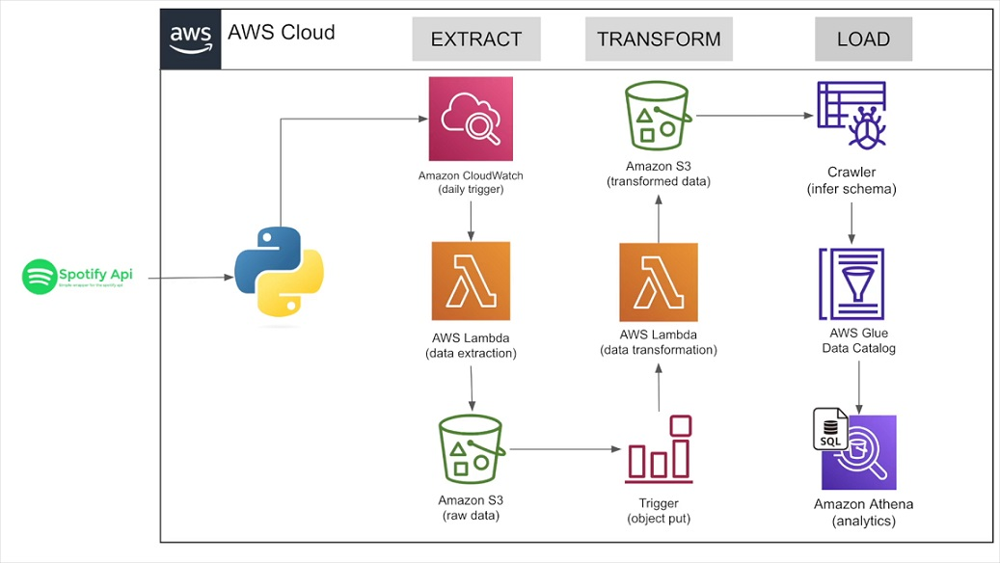

# spotify-end-to-end-etl-project
### Overview
In this project we are going to extract, transform and load spotify top global songs playlist data for every week using spotify API on AWS.

### Dataset/API
[Spotify API](https://developer.spotify.com/documentation/web-api) to retrieve data from spotify that contains information about album, artists and songs.

### Services Used
1. S3
2. AWS Lambda
3. CloudWatch
4. Glue Crawler
5. Data Catalog
6. Amazon Athena

### Execution Steps
1. Create a S3 Bucket.
2. Create a AWSLambda Function to extract data using spotify api.
3. Create a AWSLambda Function to transform extracted data.
4. Add triggers to functions to extract data at desired rate and process the data once it is extracted.
5. Create Crawler to automatically identify the data format or infer schema of the processed data to create a Data Catalog.
6. Data Catalog is used to manage data that can be used by other services.
7. Query data with Amazon Athena.
